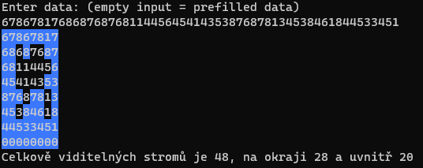

# Hledání "stromů" 
Úkol sloužil jako domácí úkol na stážistickou pozici do firmy EdHouse.

Program najde viditelné "stromy". Na konci programu se vypíše počet viditelných stromů.

Veškerý kód je okomentovaný.


## Zadání:
- Každý strom je reprezentován jednou číslicí, jejíž hodnota odpovída výšce stromu, kde 0 je nejmenší a 9 je nejvyšší
- Strom je viditelný pokud jsou všechny ostatní stromy mezi ním a okrajem Pravidelného háje kratší.
- Uvažujte pouze stromy ve stejné řadě, nebo sloupci.
- Zjednodušeně řečeno: dívejte se pouze nahoru, dolů, doleva nebo doprava směrem od daného stromu.
- Všechny stromy na okraji háje jsou viditelné – jsou totiž na okraji a žádný strom je proto nemůže zakrýt.

## Ukázka


## Spuštění
Ve složce projektu
```
dotnet run
```

## Sestavení (build)
Ve složce projektu
```
dotnet build
```
